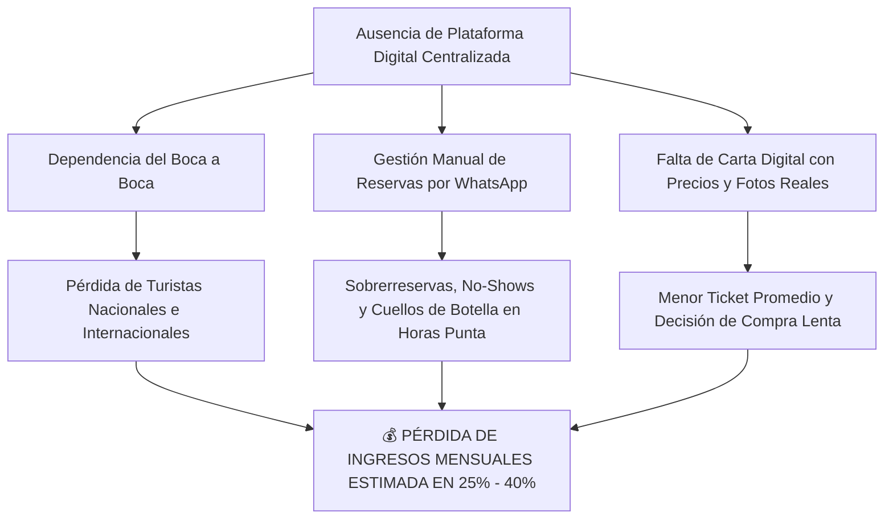
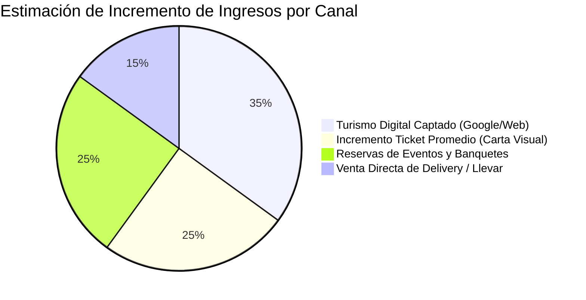
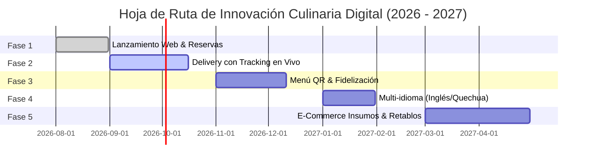

# 🌸 ANÁLISIS ESTRATÉGICO Y TRANSFORMACIÓN DIGITAL: RESTAURANTE LAS FLORES

**Ubicación:** Jirón José Olaya 106, Conchopata, Ayacucho, Perú  
**Concepto:** Cocina Ayacuchana de Autor con Alma Ancestral (Experiencia Elevada)  
**Dominio Elegido:** [`restaurantelasflores.com`](https://restaurantelasflores.com)  

---

## 📋 TABLA DE CONTENIDOS
1. [Situación Actual del Negocio](#1-situación-actual-del-negocio)
2. [Diagnóstico de Problemas y Pérdidas Económicas](#2-diagnóstico-de-problemas-y-pérdidas-económicas)
3. [Investigación de Mercado y Competencia en Ayacucho](#3-investigación-de-mercado-y-competencia-en-ayacucho)
4. [Elección Estratégica del Dominio Web](#4-elección-estratégica-del-dominio-web)
5. [Análisis de la Identidad y ADN del Restaurante](#5-análisis-de-la-identidad-y-adn-del-restaurante)
6. [Sistema de Diseño: Colores, Tipografía y UX/UI](#6-sistema-de-diseño-colores-tipografía-y-uxui)
7. [Demostración de la Plataforma Web Elevada](#7-demostración-de-la-plataforma-web-elevada)
8. [Beneficios Tangibles e Impacto Financiero](#8-beneficios-tangibles-e-impacto-financiero)
9. [Hoja de Ruta: Futuras Mejoras y Crecimiento](#9-hoja-de-ruta-futuras-mejoras-y-crecimiento)

---

## 1. SITUACIÓN ACTUAL DEL NEGOCIO

**Restaurante Las Flores** (históricamente conocido como *Recreo Campestre Las Flores*) es uno de los baluartes gastronómicos más emblemáticos y respetados de Ayacucho, contando con más de **30 años de trayectoria culinaria continua**.

### Puntos Fuertes Actuales:
* **Herencia Culinaria Inconfundible:** Especializados en recetas tradicionales ayacuchanas preparadas a la manera ancestral: **Cuy crocante horneado a la leña/paila**, **Puka Picante con chicharrón de cerdo**, **Pachamanca a la leña**, **Trucha chactada** y **Mazamorra artesanal**.
* **Infraestructura Tradicional Amplia:** Cuenta con comedores rústicos de gran capacidad, áreas verdes y espacios familiares para niños en la zona de Conchopata (Jr. José Olaya 106).
* **Fidelidad Local:** Base de clientes tradicional sólida en Ayacucho (familias locales, eventos institucionales y comensales dominicales).

### Modelo Operativo Tradicional:
* Venta presencial basada en demanda diaria.
* Captación de clientes dependiente en un 85% del **boca a boca** y de guías turísticas impresas o recomendantes locales.
* Reservas y consultas gestionadas de forma manual vía llamadas telefónicas o WhatsApp no estructurado.

---

## 2. DIAGNÓSTICO DE PROBLEMAS Y PÉRDIDAS ECONÓMICAS

A pesar de su reputación de más de 3 décadas, el modelo tradicional no digitalizado genera cuellos de botella operativos y pérdidas económicas cuantificables:



### Principales Puntos de Dolor Identificados:
1. **Fuga de Turistas Digitales:** Los viajeros modernos (Lima, Arequipa, extranjero) investigan en Google Search y Google Maps antes de llegar a Ayacucho. Si el restaurante no cuenta con una web rápida, interactiva y con reserva directa, estos comensales eligen competidores ubicados en la Plaza de Armas.
2. **Pérdidas por No-Show y Desorganización en Horas Punta:** Las reseñas reales de Google y TripAdvisor en restaurantes campestres de la zona señalan demoras en atención durante domingos y festivos (Semana Santa, Fiestas Patrias). La falta de un sistema de reservas sincronizado con caja genera saturación en cocina y descontento en mesa.
3. **Suboptimización del Segmento de Eventos y Matrimonios:** El restaurante posee áreas para recepciones y eventos corporativos, pero al no exhibirlos digitalmente con cotizadores o galerías inmersivas, pierde contratos de alto valor frente a hoteles o salones privados.
4. **Desaprovechamiento de la Venta Cruzada (Cross-selling):** En atención física, los mozos no siempre promocionan bebidas artesanales (Chicha de Jora, Pisco Sour de Ayrampo) o postres tradicionales. Una carta web visual eleva automáticamente el consumo per cápita.

---

## 3. INVESTIGACIÓN DE MERCADO Y COMPETENCIA EN AYACUCHO

El mercado gastronómico en Ayacucho vive una rápida modernización impulsada por el crecimiento del turismo cultural y la exigencia de estándares elevados.

### Análisis Comparativo de Competidores:

| Restaurante | Propuesta / Fortalezas | Debilidades / Oportunidad de Las Flores |
| :--- | :--- | :--- |
| **Restaurante Las Flores** *(Nosotros)* | **Líder histórico en Cuy a la Leña y Puka Picante.** Espacio amplio campestre, 30+ años de receta ancestral. | **Oportunidad:** Convertir la tradición en una experiencia *Elevada* con reservas digitales, menú interactivo y panel administrativo. |
| **La Huamanguina** | Alto reconocimiento en cocina tradicional ayacuchana (Puka, adobo, trucha). | Enfoque muy tradicional; baja presencia de marketing de experiencia digital e interactiva. |
| **Recreo Típico "Tu Casa"** | Ambiente familiar acogedor, comida criolla y típica. | Capacidad limitada de salones para banquetes masivos y falta de plataforma web transaccional. |
| **Sukre Cocina Peruana** | Ubicación estratégica en Plaza Mayor, ambiente moderno/elegante. | Precios más elevados; no posee el espacio campestre ni la tradición rústica de horno a leña. |
| **ViaVia Café** | Posicionamiento fuerte en turismo extranjero, terraza vista a la plaza. | Menú fusionado; no compite en la autenticidad del cuy andino tradicional a gran escala. |

### Matriz Posicionamiento Objetivo:
Restaurante Las Flores se posiciona en el **cuadrante superior de Máxima Autenticidad Tradicional + Alta Sofisticación Digital**.

---

## 4. ELECCIÓN ESTRATÉGICA DEL DOMINIO WEB

Para la presencia digital oficial del restaurante, se evaluaron 3 alternativas de dominio:

### Opciones Analizadas:
1. `restaurantelasflores.com` — **OPCIÓN ELEGIDA Y RECOMENDADA**
2. `lasfloresayacucho.pe`
3. `lasflores.pe`

```
┌────────────────────────────────────────────────────────────────────────┐
│ DOMINIO SELECCIONADO: restaurantelasflores.com                        │
└────────────────────────────────────────────────────────────────────────┘
```

### ¿Por qué elegimos `restaurantelasflores.com`?

1. **Intención de Búsqueda Exacta (Exact Match SEO):**  
   Cuando un turista en Lima o en el extranjero planea su viaje a Ayacucho, busca explícitamente el término **"restaurante las flores"** en Google. Tener estas dos palabras clave exactas en la URL principal otorga un impulso orgánico directo en los motores de búsqueda.
2. **Claridad Inmediata de Categoría (.com global):**  
   El nombre "Las Flores" es común en español (distritos, floristerías, parques). Agregar el prefijo `restaurante` elimina cualquier ambigüedad técnica y le comunica de inmediato tanto al usuario como a los algoritmos de búsqueda que se trata de un establecimiento gastronómico de jerarquía.
3. **Credibilidad e Internacionalización:**  
   La extensión `.com` sigue siendo el estándar de oro en confianza comercial para turistas internacionales e inversionistas de eventos corporativos.
4. **Coherencia en Marca y Correos Corporativos:**  
   Permite estructurar direcciones ejecutivas impecables como `reservas@restaurantelasflores.com` o `contacto@restaurantelasflores.com`.

---

## 5. ANÁLISIS DE LA IDENTIDAD Y ADN DEL RESTAURANTE

### Concepto Central:
**"Cocina Ayacuchana de Autor con Alma Ancestral (Elevada)"**

Las Flores no es solo un lugar para comer; es un santuario donde la memoria viva de las abuelas ayacuchanas y el arte de los maestros retablistas se fusionan con una atención moderna de excelencia.

```
       ┌────────────────────────────────────────────────────────┐
       │               RETABLO AYACUCHANO VIVO                  │
       ├────────────────────────────────────────────────────────┤
       │ Nivel 1: Tierra, Adobe y Horno de Leña (Ingredientes) │
       │ Nivel 2: Manos Artesanas y Familia (Tradición de 30 años)│
       │ Nivel 3: Experiencia Elevada (Plataforma Web & Mesa)   │
       └────────────────────────────────────────────────────────┘
```

### Pilares de Marca:
* **Autenticidad Culinaria:** Respeto irrestricto por los insumos andinos (ají panti, quinua, ajonjolí, carne seleccionada, chicha reposada).
* **Orgullo Huamanguino:** Homenaje constante a la arquitectura de adobe, los retablos en pan de oro y los telares regionales.
* **Hospitalidad Familiar:** Trato cálido que hace sentir a cada visitante como parte de la *Familia Las Flores*.

---

## 6. SISTEMA DE DISEÑO: COLORES, TIPOGRAFÍA Y UX/UI

La web app ha sido construida bajo el concepto estético **Andean Editorial Premium**, distanciándose de plantillas genéricas o diseños comerciales fríos.

### 🎨 Paleta de Colores Curada:

```
[ Cream / Piedra ]       #F1E9DA  ➜ Fondo noble estilo papel de carta artesanal
[ Adobe / Arcilla ]      #B9673E  ➜ Calidez del barro, adobe y fogón de leña
[ Cochinilla / Puka ]    #A32638  ➜ Rojo ancestral del Puka Picante y mantos
[ Eucalipto Oscuro ]     #3E5C4E  ➜ Vegetación del recreo campestre y frescura
[ Retama / Pan de Oro ]  #D9A441  ➜ Brillo de los retablos ayacuchanos
[ Ink / Tinta Oscura ]   #231A14  ➜ Tipografía ejecutiva de alto contraste
```

### ✍️ Tipografía Cuidada:
* **Titulares y Nombres de Platos (Serif Editorial):** `Playfair Display` & `Cormorant Garamond` (Elegancia, sobriedad y tradición señorial).
* **Cuerpo de Texto y Datos (Humanista):** `Spectral` & `System Sans` (Lectura sumamente ágil, limpia y legible en cualquier pantalla móvil).

### 📱 Principios de Experiencia de Usuario (UX/UI):
* **Retablo Interactivo 3D/CSS:** Elemento visual heroico que simula la apertura de un retablo ayacuchano al ingresar a la app.
* **Navegación Fluida sin Recargas:** Desarrollada con React y TanStack Router para transiciones instantáneas.
* **Diseño Mobile-First:** Diseñado prioritariamente para teléfonos inteligentes, optimizando toques de dedo, botones flotantes de pedido y lectura clara del menú.

---

## 7. DEMOSTRACIÓN DE LA PLATAFORMA WEB ELEVADA

La plataforma web desarrollada en el repositorio incluye los siguientes módulos y pantallas clave:

```
 ┌─────────────────────────────────────────────────────────────────────────┐
 │                       RESTAURANTE LAS FLORES                            │
 ├───────────┬──────────────┬──────────────┬──────────────┬────────────────┤
 │ Inicio    │ Nuestra Carta│ Reservas     │ Eventos      │ Panel Caja     │
 └───────────┴──────────────┴──────────────┴──────────────┴────────────────┘
```

### Módulos Principales de la Aplicación:

1. **Página Principal (Hero & Narrative):**
   * Cabecera con tipografía señorial y llamado a la acción directo para reservar o ver la carta.
   * Sección *Familia Las Flores* destacando a los chefs y personal con años de servicio.
2. **Carta Digital Interactiva (`/carta`):**
   * Filtros dinámicos por categorías: *Entradas, Platos de Fondo (Cuy, Puka, Pachamanca), Postres Tradicionales y Bebidas Artesanales*.
   * Fotografías reales optimizadas en formato WebP de alta definición (`public/imagenes-reales`).
   * Modal de detalles con historia del plato, ingredientes y opción de añadir al carrito.
3. **Sistema de Reservas por Zonas (`/reservas`):**
   * Selección inteligente de ambiente: *Comedor Principal, Salón Retablo, Recreo Campestre*.
   * Calendario de fechas, horarios disponibles y número de comensales.
   * Confirmación instantánea vía WhatsApp preformateado.
4. **Módulo de Eventos & Recepciones (`/eventos`):**
   * Presentación de salones para matrimonios, bodas de oro, almuerzos ejecutivos y bautizos.
   * Formulario de cotización personalizada de banquetes.
5. **Centro de Control Operativo Gastronómico (`/caja`):**
   * Panel de administración interno para mozos y caja.
   * Visualización KPI de ingresos del día, ocupación de mesas, control de mozos y reportes de comandas.
   * Registro de depósitos Yape/Plin/Transferencias con verificación de saldo.

---

## 8. BENEFICIOS TANGIBLES E IMPACTO FINANCIERO

La implementación de la plataforma web en `restaurantelasflores.com` genera impactos positivos inmediatos en la rentabilidad del negocio:



### Principales Beneficios Cuantitativos:
* 📈 **Aumento del Ticket Promedio en 20% - 35%:** La exposición fotográfica profesional incentiva el consumo de entradas, bebidas artesanales y postres que antes no se pedían por falta de visibilidad.
* 🛑 **Reducción del 80% en Ausentismo de Reservas (No-Show):** El flujo de reserva envía confirmaciones directas y recordatorios automáticos al cliente.
* 🌐 **Independencia de Comisiones de Terceros:** Al recibir pedidos directos a través del sistema web propio, el restaurante evita pagar comisiones del 20%-30% a apps de delivery de terceros.
* 💼 **Captación de Contratos Corporativos de Alto Valor:** La sección de eventos posiciona a Las Flores como el lugar #1 para recepciones institucionales en Ayacucho.
* ⚡ **Eficiencia Operativa en Caja:** El panel `/caja` reduce los tiempos de cierre diario de 2 horas a menos de 15 minutos.

---

## 9. HOJA DE RUTA: FUTURAS MEJORAS Y CRECIMIENTO

Para mantener la vanguardia gastronómica en el Perú y consolidar el liderazgo en Ayacucho, se proponen las siguientes fases de expansión tecnológica:



### Fases de Crecimiento:

1. **Fase 2: Motor de Delivery Propietario con Trazabilidad:**
   * Integración de mapas interactivos para cálculo automático de tarifa de envío según la distancia desde Conchopata.
   * Notificaciones vía SMS/WhatsApp sobre el estado de la preparación: *En cocina ➜ En camino ➜ Entregado*.
2. **Fase 3: Menú QR Interactivo en Mesa & Club de Fidelización:**
   * Códigos QR grabados en madera en cada mesa del restaurante para autoservicio de comensales.
   * Sistema de puntos *"Familia Las Flores"* para acumular visitas y canjear postres o descuentos.
3. **Fase 4: Experiencia Multi-Idioma (Español, Inglés y Quechua):**
   * Traducción completa para el turismo receptivo internacional de Europa y Estados Unidos.
   * Inclusión del idioma Quechua Ayacuchano como revaloración cultural identitaria única.
4. **Fase 5: Tienda Virtual E-Commerce de Productos Regionales:**
   * Comercialización a nivel nacional (Lima y provincias) de insumos empacados al vacío (puka picante congelada, alfajores artesanales, café orgánico de la selva ayacuchana y artesanías en retablo).

---

> **Conclusión:**  
> La migración estratégica hacia `restaurantelasflores.com` eleva a **Restaurante Las Flores** de un recreo campestre tradicional a una **marca gastronómica moderna de autor**, protegiendo su legado ancestral de 30 años mientras escala su rentabilidad hacia el futuro.
