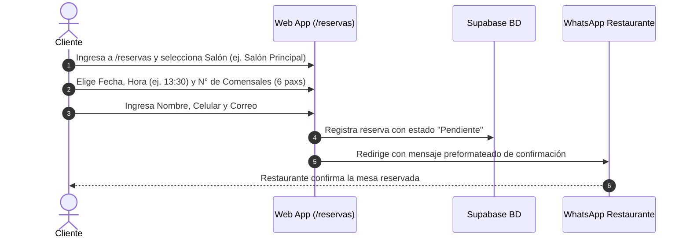
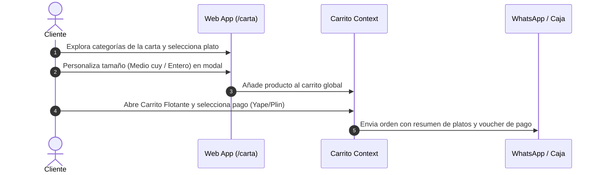

# 📖 DOCUMENTACIÓN TÉCNICA Y FUNCIONAL COMPLETA
### Plataforma Web Elevada: Restaurante Las Flores

**Nombre del Proyecto:** Las Flores Elevated Web App  
**Repositorio / Entorno:** React + TypeScript + TanStack Router + Tailwind CSS + Supabase  
**Dominio Objetivo:** [`restaurantelasflores.com`](https://restaurantelasflores.com)  
**Ubicación del Negocio:** Jirón José Olaya 106, Conchopata, Ayacucho, Perú  

---

## 📋 TABLA DE CONTENIDOS
1. [Visión General del Sistema](#1-visión-general-del-sistema)
2. [Arquitectura Culinaria & Stack Tecnológico](#2-arquitectura-culinaria--stack-tecnológico)
3. [Estructura del Proyecto y Directorios](#3-estructura-del-proyecto-y-directorios)
4. [Módulos Funcionales y Rutas de la Aplicación](#4-módulos-funcionales-y-rutas-de-la-aplicación)
5. [Componentes Clave y Sistema de Diseño](#5-componentes-clave-y-sistema-de-diseño)
6. [Flujos de Usuario y Procesos de Negocio](#6-flujos-de-usuario-y-procesos-de-negocio)
7. [Base de Datos e Integración con Supabase](#7-base-de-datos-e-integración-con-supabase)
8. [Manual Operativo y Guía de Despliegue](#8-manual-operativo-y-guía-de-despliegue)

---

## 1. VISIÓN GENERAL DEL SISTEMA

### ¿Qué es la Web de Restaurante Las Flores?
La web de **Restaurante Las Flores** es una **plataforma gastronómica transaccional y sistema de gestión integral**, diseñada para elevar la experiencia digital de un recreo campestre tradicional con más de **30 años de prestigio culinario** en Ayacucho.

La aplicación no se limita a ser un sitio informativo estático; funciona como un **ecosistema de 3 capas**:
1. **Portal del Comensal (Público):** Permite explorar la carta interactiva con fotografías reales WebP, reservar mesas en salones específicos, cotizar eventos y realizar pedidos para llevar o delivery.
2. **Sistema de Caja y Operación (`/caja`):** Panel interno en tiempo real para mozos y cajeros que gestiona la ocupación de mesas, control de comandas, comisiones y cobranza por Yape, Plin y tarjetas.
3. **Panel Administrativo (`/admin`):** Centro de gestión para administración donde se configuran productos, categorías, zonas de salones, cupones de descuento y bloqueos de fechas.

---

## 2. ARQUITECTURA CULINARIA & STACK TECNOLÓGICO

El proyecto está desarrollado con las tecnologías web modernas de mayor rendimiento y velocidad de carga:

```
 ┌────────────────────────────────────────────────────────────────────────┐
 │                      STACK TECNOLÓGICO PRINCIPAL                       │
 ├──────────────────┬──────────────────┬──────────────────┬───────────────┤
 │ Frontend Core    │ React 18         │ Lenguaje         │ TypeScript    │
 │ Enrutamiento     │ TanStack Router  │ Estilos          │ Tailwind CSS  │
 │ Bundler / Build  │ Vite             │ Base de Datos    │ Supabase (PG) │
 │ Iconografía      │ Lucide React     │ Runtime Local    │ Bun / Node.js │
 └──────────────────┴──────────────────┴──────────────────┴───────────────┘
```

### Principales Bibliotecas y Utilidades:
* **`@tanstack/react-router`:** Enrutamiento por código seguro (type-safe) y transiciones instantáneas sin recargas de página.
* **`@supabase/supabase-js`:** Autenticación de usuarios (Google, Facebook), persistencia de datos en PostgreSQL y cliente en tiempo real.
* **`lucide-react`:** Iconografía vectorial estilizada para interfaces gastronómicas.
* **`webp-compressor.ts` & `optimize-carta-images.cjs`:** Herramientas personalizadas para la optimización y compresión automatizada de fotos reales de platillos.

---

## 3. ESTRUCTURA DEL PROYECTO Y DIRECTORIOS

```
las-flores-elevated-main/
├── docs/                             # Documentación estratégica, análisis e informes
│   ├── ANALISIS_RESTAURANTE_LAS_FLORES.md
│   ├── REPORTE_AUDITORIA_Y_JUSTIFICACION_CEO.md
│   └── PRESENTACION_SLIDES_RESTAURANTE_LAS_FLORES.md
├── public/                           # Recursos estáticos servidos públicamente
│   ├── favicon.png, images.png
│   └── imagenes-reales/              # Banco de imágenes optimizadas en WebP
│       ├── CARTA/                    # Fotografías de platillos por categoría
│       ├── Salones/                  # Ambientes del restaurante
│       └── Eventos/                  # Galería de recepciones
├── scripts/                          # Scripts de utilería para optimización de imágenes
├── src/
│   ├── components/                   # Componentes de UI reutilizables
│   │   ├── AdminAnalyticsSection.tsx # Gráficos y reportes de administración
│   │   ├── CartSidebar.tsx           # Carrito flotante y checkout
│   │   ├── CashierKPIHeader.tsx      # Cabecera de métricas para caja
│   │   ├── CashierOrderCard.tsx      # Card de comandas de mesa
│   │   ├── CashierReservationCard.tsx# Card de reservas en caja
│   │   ├── MenuModal.tsx             # Modal de detalles de platillos
│   │   ├── RetabloWrapper.tsx        # Experiencia visual 3D del retablo
│   │   ├── SeatSelector.tsx          # Selector gráfico de mesas
│   │   ├── SiteNavigationMenu.tsx    # Menú de navegación principal
│   │   └── site-footer.tsx           # Pie de página y enlaces institucionales
│   ├── context/
│   │   └── CartContext.tsx           # Estado global del carrito de compras
│   ├── features/
│   │   ├── jobs/                     # API y estado de ofertas laborales
│   │   └── zones/                    # API de salones y zonas del restaurante
│   ├── lib/
│   │   ├── liveProducts.ts           # Servicio de sincronización de carta Supabase
│   │   ├── supabase.ts               # Cliente Supabase & métodos de Auth
│   │   └── webp-compressor.ts        # Compresor de fotos WebP en cliente
│   ├── routes/                       # Vistas y páginas de la aplicación
│   │   ├── __root.tsx                # Layout raíz (Nav + Footer + Outlet)
│   │   ├── index.tsx                 # Landing Page Principal
│   │   ├── carta.tsx                 # Carta Digital Interactiva
│   │   ├── reservas.tsx              # Sistema de Reservas por Zonas
│   │   ├── eventos.tsx               # Módulo de Eventos & Banquetes
│   │   ├── contacto.tsx              # Ubicación Google Maps & Contacto
│   │   ├── familia-las-flores.tsx    # Historia y equipo humano
│   │   ├── caja.tsx                  # Centro de Control de Caja
│   │   ├── admin.tsx                 # Panel Administrativo General
│   │   ├── galeria.tsx               # Galería fotográfica
│   │   └── unete-al-equipo.tsx       # Bolsa de trabajo
│   ├── styles.css                    # Tokens del Sistema de Diseño (Tailwind v4)
│   └── main.tsx                      # Punto de entrada de la aplicación React
```

---

## 4. MÓDULOS FUNCIONALES Y RUTAS DE LA APLICACIÓN

### 🏠 1. Landing Page Principal (`src/routes/index.tsx`)
* **Retablo Interactivo 3D/CSS (`RetabloWrapper.tsx`):** Bienvenida inmersiva que simula las puertas de un retablo ayacuchano abriéndose al ingresar.
* **Sección Hero:** Tipografía señorial, propuesta de valor *"Cocina Ayacuchana de Autor con Alma Ancestral"* y llamadas a la acción (*Reservar Mesa* / *Ver Carta*).
* **Sección Historia & Familia:** Presentación de los cocineros y personal de servicio con años de trayectoria.
* **Acceso Rápido a Platillos Estrella:** Vista previa del Cuy a la Leña, Puka Picante y Pachamanca.

### 🍽️ 2. Carta Digital Interactiva (`src/routes/carta.tsx`)
* **Filtros por Categoría:** *Desayunos, Entradas (Qapchi, Caldo de Cuy), Platos Típicos (Cuy, Puka, Pachamanca), Especialidades del Chef, Bebidas Artesanales y Postres*.
* **Sincronización en Tiempo Real:** Consume datos de Supabase vía `liveProducts.ts` con respaldo estático.
* **Modal de Platillo (`MenuModal.tsx`):** Muestra foto ampliada, lista de ingredientes, opciones de personalización (ej. *Medio cuy / Cuy entero*) y adición al carrito.

### 📅 3. Sistema Transaccional de Reservas (`src/routes/reservas.tsx`)
* **Selección por Ambientes/Zonas:**
  * *Salón Principal:* Mesa para 13 personas con retablos en pan de oro.
  * *Salón Ventana:* Vista colonial para 10 personas.
  * *Estrado:* Escenario elevado privado para 6 personas.
  * *Salón Entrada:* Salón acogedor para 6 personas.
  * *Terraza & Jardín:* Espacios al aire libre para 4 a 6 personas.
* **Configuración del Turno:** Fecha, horario (*Desayuno 09:00-11:00 / Almuerzo 11:30-17:00*) y número de comensales.
* **Confirmación por WhatsApp:** Genera un mensaje preformateado directo al WhatsApp del restaurante con el código de reserva.

### 🎉 4. Módulo de Eventos & Recepciones (`src/routes/eventos.tsx`)
* **Catálogo de Salones para Banquetes:** Bodas, aniversarios, cumpleaños y almuerzos de negocios.
* **Formulario de Cotización:** Permite solicitar presupuestos según el tipo de evento, número de invitados y requerimientos de catering.

### 📍 5. Contacto & Ubicación (`src/routes/contacto.tsx`)
* **Mapa Interactivo:** Integración de Google Maps con la ubicación exacta en Jr. José Olaya 106, Conchopata, Ayacucho.
* **Formulario de Consultas & Información de Horarios:** Teléfonos de contacto directos, correo corporativo y horario de atención.

### 💵 6. Centro de Control Operativo de Caja (`src/routes/caja.tsx`)
* **Métricas KPI en Tiempo Real (`CashierKPIHeader.tsx`):** Total vendido en el día, número de comandas activas, ocupación de salones y comisiones de mozos.
* **Vistas de Comandas:** Vista Kanban (`CashierKanbanView.tsx`) y lista detallada (`CashierListView.tsx`) para gestionar estados: *En preparación ➜ Servido ➜ Pagado*.
* **Control de Pagos:** Registro de depósitos Yape, Plin, tarjetas de crédito/débito y efectivo.

### ⚙️ 7. Panel Administrativo General (`src/routes/admin.tsx`)
* **Gestión de Menú (`AdminProductModal.tsx` / `AdminCategoryFormModal.tsx`):** Crear, editar, activar o desactivar platos y categorías.
* **Gestión de Salones (`AdminZonesSection.tsx`):** Cambiar capacidad y estado de salones.
* **Bloqueos de Fecha (`AdminBlackoutModal.tsx`):** Deshabilitar reservas en feriados o días de mantenimiento.
* **Gestión de Cupones (`AdminCouponModal.tsx`):** Crear códigos promocionales de descuento.

---

## 5. COMPONENTES CLAVE Y SISTEMA DE DISEÑO

### 🎨 Tokens del Sistema de Diseño (`src/styles.css`)
Desarrollado bajo el concepto **Andean Editorial Premium**:

```css
--cream: #F1E9DA;       /* Papel artesanal, fondo noble */
--adobe: #B9673E;       /* Calidez del barro y fogón de leña */
--cochinilla: #A32638;  /* Rojo ancestral del Puka Picante */
--eucalipto: #3E5C4E;   /* Vegetación del recreo campestre */
--retama: #D9A441;      /* Dorado de retablos en pan de oro */
--ink: #231A14;         /* Tipografía de alto contraste */
```

### 🛍️ Carrito Flotante & Checkout (`CartSidebar.tsx`)
* **Gestión de Estado (`CartContext.tsx`):** Permite añadir, eliminar y modificar cantidades de platillos desde cualquier ruta de la web.
* **Desglose de Totales:** Muestra subtotal, impuestos y opción de aplicar cupones de descuento.
* **Modal de Pago:** Simulación de pagos con Yape/Plin (código QR) y derivación de la orden final al canal oficial de WhatsApp del restaurante.

---

## 6. FLUJOS DE USUARIO Y PROCESOS DE NEGOCIO

### Flujo 1: Reserva de Mesa por el Comensal


### Flujo 2: Pedido desde la Carta Digital


---

## 7. BASE DE DATOS E INTEGRACIÓN CON SUPABASE

El proyecto está conectado a un proyecto de **Supabase PostgreSQL** mediante el cliente configurado en `src/lib/supabase.ts`.

### Tablas Principales en Base de Datos:

1. **`products`:**  
   * `id` (UUID), `name` (text), `description` (text), `price` (numeric), `image_url` (text), `category_id` (UUID), `is_active` (boolean), `sort_order` (int).
2. **`categories`:**  
   * `id` (UUID), `name` (text), `slug` (text), `sort_order` (int), `is_active` (boolean).
3. **`reservations`:**  
   * `id` (UUID), `customer_name` (text), `customer_phone` (text), `zone_id` (text), `reservation_date` (date), `reservation_time` (text), `party_size` (int), `status` (text).
4. **`restaurant_zones`:**  
   * `id` (text), `name` (text), `max_capacity` (int), `is_active` (boolean).

---

## 8. MANUAL OPERATIVO Y GUÍA DE DESPLIEGUE

### Requisitos Previos:
* Node.js v18+ o Bun instalado en la máquina local.
* Git para control de versiones.

### 🚀 Comandos de Ejecución Local:

```bash
# 1. Clonar el repositorio e ingresar a la carpeta
git clone <URL_REPOSITORIO>
cd las-flores-elevated-main

# 2. Instalar dependencias con npm o bun
npm install
# o
bun install

# 3. Iniciar el servidor de desarrollo local (Vite)
npm run dev
```

La aplicación se ejecutará localmente en [http://localhost:5173](http://localhost:5173).

### 📦 Compilación para Producción (Build):

```bash
# Compilar bundle optimizado para despliegue (Vercel / Netlify / VPS)
npm run build

# Previsualizar el build compilado localmente
npm run preview
```

### 🖼️ Optimización de Fotografías Culinarias:
Antes de subir nuevas imágenes a la carpeta `public/imagenes-reales`, ejecuta el script de optimización automatizado:

```bash
node scripts/optimize-carta-images.cjs
```
Este script reducirá la resolución y convertirá las fotos grandes a formato **WebP ligero (<200KB)** para garantizar tiempos de carga menores a 1 segundo en teléfonos móviles.

---

> **Conclusión:**  
> La plataforma web de **Restaurante Las Flores** combina la herencia cultural de 30 años de cocina ayacuchana con la ingeniería de software más avanzada, asegurando velocidad, belleza visual y alta conversión comercial.
