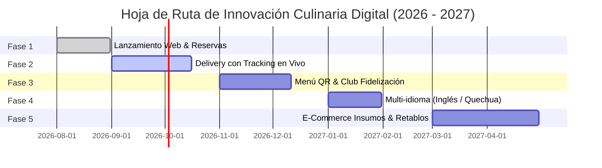

# 🎭 ESTRUCTURA DE DIAPOSITIVAS (MARP / PPTX)
## Transformación Digital & Estrategia de Negocio: Restaurante Las Flores

> **Instrucciones de uso:** Este archivo `.md` está optimizado para convertirse directamente a una presentación ejecutable en **PowerPoint (PPTX)**, **Marp**, **Gamma App**, **Slidev** o **Canva**. Cada diapositiva está separada por `---` y contiene la estructura visual de la diapositiva junto con las **Notas del Orador** (*Speaker Notes*) para la exposición ante el CEO.

---

<!-- slide -->
<!-- _class: lead -->
<!-- _bgColor: #F1E9DA -->
<!-- _color: #231A14 -->

# 🌸 RESTAURANTE LAS FLORES
### Transformación Digital & Posicionamiento de Marca Gastronómica Elevada

**Presentado a:** Gerencia General / CEO  
**Dominio Oficial:** [`restaurantelasflores.com`](https://restaurantelasflores.com)  
**Ubicación:** Jirón José Olaya 106, Conchopata, Ayacucho  

---

**🎙️ NOTAS DEL ORADOR (SLIDE 1):**  
"Buenos días, Gerencia. Hoy presentamos la estrategia integral de transformación digital para Restaurante Las Flores. El objetivo de este proyecto no es solo tener una página web, sino convertir nuestros 30 años de tradición gastronómica en Ayacucho en una plataforma transaccional de vanguardia que maximice la rentabilidad y capture al turista moderno."

---

<!-- slide -->

## 📋 CONTENIDO DE LA PRESENTACIÓN

1. **Situación Actual del Negocio**
2. **Diagnóstico de Problemas y Pérdidas Económicas**
3. **Investigación de Mercado y Competencia**
4. **Elección Estratégica del Dominio Web**
5. **Análisis de la Identidad y ADN del Restaurante**
6. **Sistema de Diseño (Colores, Tipografía y UX/UI)**
7. **Demostración de la Plataforma Web & Auditoría**
8. **Beneficios Tangibles e Impacto Financiero (ROI)**
9. **Hoja de Ruta: Futuras Mejoras y Crecimiento**

---

**🎙️ NOTAS DEL ORADOR (SLIDE 2):**  
"Cubriremos el flujo estratégico completo: desde la realidad operativa del restaurante físico hasta la justificación financiera del desarrollo web propio, evaluando las inconsistencias detectadas y cómo las resolveremos."

---

<!-- slide -->

## 🏛️ 1. SITUACIÓN ACTUAL DEL NEGOCIO

### Un Baluarte Gastronómico con 30+ Años de Historia

* **Herencia Culinaria:** Ícono indiscutible de la cocina típica en Ayacucho (Cuy crocante a la leña, Puka Picante, Pachamanca y Mazamorra).
* **Infraestructura Tradicional:** Amplios comedores rústicos, áreas verdes y salones familiares en Conchopata (Jr. José Olaya 106).
* **Modelo Operativo Tradicional:**
  * 85% de la captación depende del boca a boca y recomendación física.
  * Reservas manuales desordenadas por teléfono/WhatsApp.
  * Alta afluencia concentrada en fines de semana y festivos.

---

**🎙️ NOTAS DEL ORADOR (SLIDE 3):**  
"Las Flores tiene una marca fuertísima y una receta imbatible. Sin embargo, nuestro modelo operativo dependía exclusivamente del cliente presencial. Sin una plataforma digital, estábamos dejando libre el terreno para competidores más jóvenes o mejor ubicados."

---

<!-- slide -->

## ⚠️ 2. PROBLEMAS Y PÉRDIDAS ECONÓMICAS

```
┌─────────────────────────────────────────────────────────────────────────┐
│                    FUGA DE INGRESOS MENSUALES ESTIMADA                  │
│                              25% - 40%                                  │
└─────────────────────────────────────────────────────────────────────────┘
```

1. **Fuga de Turistas Digitales:** El turista de Lima o del extranjero busca en Google Maps antes de viajar. Si no encuentra reserva web con fotos reales, elige competidores de la Plaza de Armas.
2. **Mesas Vacías por No-Shows:** Reservas informales sin cobro de seña provocan mesas bloqueadas de 10-13 personas que finalmente no asisten.
3. **Pérdida de Contratos de Eventos:** Áreas campestres y salones desaprovechados por falta de un catálogo digital para matrimonios y corporativos.
4. **Comisiones Altas de Terceros:** Depender de apps de delivery externas resta entre un 20% y 30% del margen por pedido.

---

**🎙️ NOTAS DEL ORADOR (SLIDE 4):**  
"Estimamos que la falta de un canal digital propio nos cuesta entre 25% y 40% en ingresos no captados. Cada fin de semana sin un sistema automatizado de reservas representa dinero dejado sobre la mesa."

---

<!-- slide -->

## 🔍 3. INVESTIGACIÓN DE MERCADO Y COMPETENCIA

| Restaurante | Propuesta / Fortalezas | Oportunidad para Las Flores |
| :--- | :--- | :--- |
| **Restaurante Las Flores** | **Líder histórico en Cuy a la leña.** Espacio campestre amplio. | **Convertirse en la opción #1 Digital + Tradicional.** |
| **La Huamanguina** | Tradición reconocida en puka y adobo. | Su presencia web es mínima y tradicional. |
| **Recreo "Tu Casa"** | Ambiente familiar rústico. | Capacidad limitada para banquetes masivos. |
| **Sukre Cocina** | Ubicación en Plaza Mayor, ambiente moderno. | Precios elevados; sin espacio campestre. |
| **ViaVia Café** | Dominio del turista extranjero en la plaza. | Menú fusión; no compite en cuy tradicional. |

---

**🎙️ NOTAS DEL ORADOR (SLIDE 5):**  
"El mercado de Ayacucho se divide entre la tradición campestre sin tecnología y la modernidad de la plaza sin espacio campestre. Las Flores tiene la oportunidad única de dominar el cuadrante de **Máxima Autenticidad Tradicional con Alta Sofisticación Digital**."

---

<!-- slide -->

## 🌐 4. ELECCIÓN ESTRATÉGICA DEL DOMINIO

### Opciones Evaluadas:
1. `restaurantelasflores.com` — **OPCIÓN ELEGIDA**
2. `lasfloresayacucho.pe`
3. `lasflores.pe`

### ¿Por qué `restaurantelasflores.com`?
* **SEO por Palabras Clave Exactas:** Coincide exactamente con lo que el turista busca en Google: *"restaurante las flores"*.
* **Claridad Total de Nicho:** Elimina confusión con distritos o floristerías llamadas "Las Flores".
* **Autoridad Internacional (.com):** Otorga máxima confianza para turismo extranjero y contratos corporativos.

---

**🎙️ NOTAS DEL ORADOR (SLIDE 6):**  
"Elegimos `restaurantelasflores.com` porque es el dominio exacto con mayor volumen de búsqueda en Google. Nos posiciona inmediatamente como el restaurante oficial sin ambigüedades."

---

<!-- slide -->

## 🎨 5. ANÁLISIS DE LA IDENTIDAD DE MARCA

### Concepto: *"Cocina Ayacuchana de Autor con Alma Ancestral"*

```
      ┌────────────────────────────────────────────────────────┐
      │               EL RETABLO AYACUCHANO VIVO               │
      ├────────────────────────────────────────────────────────┤
      │ Nivel 1: Horno de Leña, Barro y Adobe (Insumos)        │
      │ Nivel 2: Familia Las Flores (30 años de sazón viva)    │
      │ Nivel 3: Plataforma Web Elevada (Experiencia 360°)     │
      └────────────────────────────────────────────────────────┘
```

* **Autenticidad Culinaria:** Respeto irrestricto por recetas ancestrales.
* **Orgullo Huamanguino:** Homenaje constante a la arquitectura de adobe y retablos.
* **Hospitalidad Familiar:** Trato cálido que integra al comensal a la familia.

---

**🎙️ NOTAS DEL ORADOR (SLIDE 7):**  
"El ADN de nuestra marca es el Retablo Ayacuchano. Cada ambiente del restaurante y cada sección de la plataforma web representa una pieza del retablo vivo de nuestra cultura."

---

<!-- slide -->

## 🖌️ 6. SISTEMA DE DISEÑO (COLORES Y TIPOGRAFÍA)

### Estética: *Andean Editorial Premium*

* **🎨 Paleta Cultural:**
  * **Cream / Piedra (`#F1E9DA`):** Fondo noble estilo papel artesanal.
  * **Adobe / Arcilla (`#B9673E`):** Calidez del fogón de leña y la tierra.
  * **Cochinilla / Puka (`#A32638`):** Rojo ancestral del Puka Picante.
  * **Eucalipto Oscuro (`#3E5C4E`):** Vegetación campestre.
  * **Retama / Pan de Oro (`#D9A441`):** Brillo de los retablos.
* **✍️ Tipografía Editorial:**
  * *Titulares:* **Playfair Display / Cormorant Garamond** (Elegancia señorial).
  * *Cuerpo:* **Spectral / System Sans** (Lectura ágil en móviles).

---

**🎙️ NOTAS DEL ORADOR (SLIDE 8):**  
"Evitamos plantillas comerciales baratas o estridentes. Diseñamos un sistema visual editorial inspirado en el arte andino, con colores extraídos del adobe, la cochinilla y la retama."

---

<!-- slide -->

## 🖥️ 7. DEMOSTRACIÓN DE LA PLATAFORMA WEB

### Estructura de la Web App (`restaurantelasflores.com`)

* **Hero & Storytelling (`/`):** Apertura de retablo interactivo en 3D/CSS y narrativa de la *Familia Las Flores*.
* **Carta Digital Interactiva (`/carta`):** Filtros por categoría, fotos reales WebP de alta resolución y modales de historia de plato.
* **Reserva por Zonas (`/reservas`):** Selección de ambientes (*Salón Principal, Ventana, Estrado, Terraza, Jardín*).
* **Módulo de Eventos (`/eventos`):** Cotizador de banquetes y bodas.
* **Centro de Control Operativo (`/caja`):** Panel administrativo interno para mozos, comandas y cierre de caja.

---

**🎙️ NOTAS DEL ORADOR (SLIDE 9):**  
"La web app ya está construida y funcional. Cuenta con navegación ultra rápida sin recargas de página y un panel de administración interno que permite a la caja gestionar pedidos y reservas en tiempo real."

---

<!-- slide -->

## 🛠️ 7. AUDITORÍA DE INCONSISTENCIAS Y SOLUCIONES

| Inconsistencia Detectada | Diagnóstico | Solución Prioritaria |
| :--- | :--- | :--- |
| **Carta Estática vs. Supabase** | Datos duplicados entre fallback local y base de datos. | Unificar fuente de datos centralizada con API. |
| **Pago Simulada en Carrito** | Pago Yape/Plin envía captura manual por WhatsApp. | Integrar pasarela real (IziPay/Culqi) con Webhook. |
| **Reservas Sin Seña** | Salones grandes (13 paxs) se reservan sin depósito. | Exigir seña del 20% en grupos de más de 6 personas. |
| **Falta de Aspectos Legales** | Ausencia de Libro de Reclamaciones Digital y RUC. | Añadir modal legal INDECOPI y RUC en footer. |

---

**🎙️ NOTAS DEL ORADOR (SLIDE 10):**  
"Para ser transparentes con la Gerencia, hemos auditado el sistema y detectado 4 puntos de ajuste clave. Resolveremos estas inconsistencias en el próximo sprint antes de la salida a producción masiva."

---

<!-- slide -->

## 📈 8. BENEFICIOS FINANCIEROS E IMPACTO (ROI)

```
📈 +20% a 35% Ticket Promedio | 🛑 -80% En No-Shows | 🌐 0% Comisiones a Terceros
```

1. **Ahorro Directo de Licencias:** Evitamos pagar más de **$300-$500 USD/mes** en software externo de reservas y comandas.
2. **Incremento del Ticket Promedio:** La presentación visual de la carta impulsa el consumo de entradas, bebidas artesanales y postres.
3. **Venta de Eventos de Alto Valor:** La sección `/eventos` posiciona a Las Flores como sede #1 de banquetes corporativos y bodas.
4. **Eficiencia en Caja:** Cierre diario de caja reducido de 2 horas a menos de 15 minutos.

---

**🎙️ NOTAS DEL ORADOR (SLIDE 11):**  
"Gerencia, la inversión en este software propio se paga sola. Nos ahorra miles de dólares en comisiones de terceros y aumenta el consumo promedio por mesa gracias a la carta visual."

---

<!-- slide -->

## 🚀 9. FUTURAS MEJORAS Y HOJA DE RUTA



---

**🎙️ NOTAS DEL ORADOR (SLIDE 12):**  
"Nuestra hoja de ruta incluye motor de delivery con mapa en vivo, menú QR grabado en madera para las mesas y la traducción al idioma Quechua Ayacuchano como sello único de revaloración cultural."

---

<!-- slide -->
<!-- _class: lead -->
<!-- _bgColor: #B9673E -->
<!-- _color: #F1E9DA -->

# 🌸 ¡GRACIAS!
### Restaurante Las Flores — Ayacucho
**Transformación Digital Gastronómica Aprobada**

*¿Preguntas o comentarios de la Gerencia?*

🔗 [`restaurantelasflores.com`](https://restaurantelasflores.com)  
📍 Jirón José Olaya 106, Conchopata, Ayacucho  

---

**🎙️ NOTAS DEL ORADOR (SLIDE 13):**  
"Muchas gracias, Gerencia General. Quedamos a su entera disposición para responder preguntas y proceder con la aprobación de la siguiente fase."
