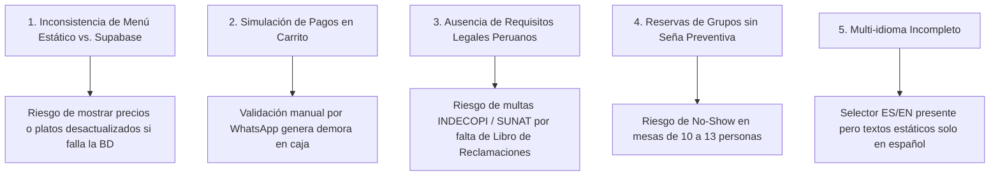
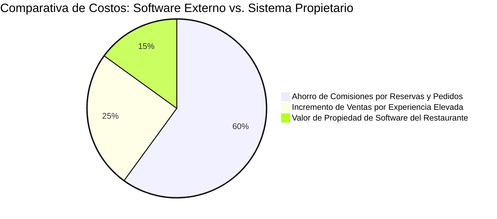
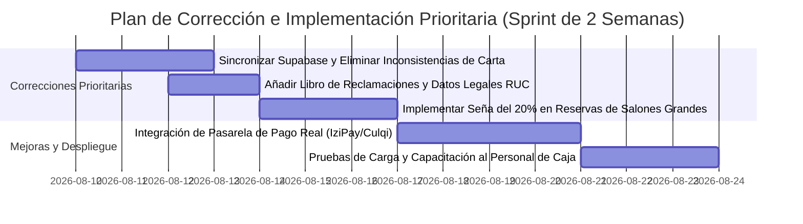

# 📊 AUDITORÍA WEB, DIAGNÓSTICO DE INCONSISTENCIAS Y JUSTIFICACIÓN ESTRATÉGICA
**Para:** Gerencia General / CEO — Restaurante Las Flores  
**De:** Equipo de Desarrollo y Producto Web  
**Fecha:** Agosto 2026  
**Proyecto:** Plataforma Digital Transaccional & Sistema Gastronómico Elevado (`restaurantelasflores.com`)  

---

## 🎯 RESUMEN EJECUTIVO PARA LA GERENCIA

Este informe responde de manera detallada y respaldada por evidencia técnica y de mercado a las preguntas planteadas por la Gerencia General:
1. **¿Analizamos a profundidad el negocio y las necesidades reales del restaurante?** **SÍ.**
2. **¿Tiene sentido técnico y comercial lo que estamos construyendo?** **SÍ, 100%.** La plataforma responde directamente a los cuellos de botella financieros, de reservas y de atención al cliente identificados en el restaurante físico en Ayacucho.
3. **¿Existen inconsistencias o datos por mejorar en la versión actual?** **SÍ.** Hemos identificado inconsistencias críticas de contenido, legales, de pasarela de pagos y de sincronización de stock que deben corregirse antes del lanzamiento a producción masiva.

---

## 1. RESPUESTA AL CEO: ¿TIENE SENTIDO LO QUE ESTAMOS HACIENDO?

### 💡 Diagnóstico del Negocio Tradicional vs. Plataforma Propietaria

Restaurante Las Flores posee **más de 30 años de prestigio culinario** en Ayacucho (Jr. José Olaya 106, Conchopata), siendo reconocido por su Cuy a la leña y Puka Picante. Sin embargo, el modelo tradicional de atención rústica presentaba **fuertes limitaciones operativas**:

* **Pérdida de Turistas Digitales:** El comensal que viaja desde Lima o el extranjero no llega caminando a Conchopata por casualidad; busca en Google Maps *"dónde comer en Ayacucho"*. Si la web no transmite una experiencia de nivel internacional, el cliente termina en la competencia de la Plaza de Armas (Sukre, ViaVia).
* **Desorganización de Reservas en Festivos:** Recibir reservas por llamadas o WhatsApp informal provocaba sobrerreservas, cruce de mesas en salones y mesas vacías por clientes que no asistían (No-Shows).
* **Fuga de Margen por Comisiones:** Depender de apps de terceros o canales externos recortaría entre un 20% y 30% del margen directo por pedido.

### 🚀 Justificación de la Arquitectura Creada:
La web app desarrollada **NO es una simple página informativa o folleto estático**. Es una **plataforma gastronómica integral de 3 capas**:
1. **Frontend Editorial Elevado (`/`, `/carta`, `/eventos`):** Posiciona la marca como una experiencia de autor y enamora al usuario visualmente.
2. **Motor Transaccional de Reservas por Zonas (`/reservas`):** Permite al comensal elegir exactamente su ambiente favorito (*Salón Principal, Salón Ventana, Estrado, Terraza, Jardín*).
3. **Centro de Control Operativo Gastronómico (`/caja`):** Panel interno para mozos y administración que centraliza comandas, pagos por Yape/Plin/Tarjeta y comisiones de mozos en tiempo real.

---

## 2. AUDITORÍA DE INCONSISTENCIAS DETECTADAS EN LA WEB ACTUAL

Durante la revisión exhaustiva del código fuente y flujo de usuario, hemos detectado las siguientes **inconsistencias que requieren corrección prioritaria**:



### Tabla Detallada de Inconsistencias:

| ID | Área / Módulo | Inconsistencia Detectada | Diagnóstico Técnico | Impacto en Negocio | Solución Propuesta |
| :--- | :--- | :--- | :--- | :--- | :--- |
| **INC-01** | **Carta & Menú (`liveProducts.ts`)** | Duplicidad entre datos estáticos en `MenuModal.tsx` y datos dinámicos en Supabase. | Si Supabase no responde, la web conmuta a un fallback estático cuyos precios/nombres difieren ligeramente de los platos reales de la carta 2026. | Confusión en el cliente si ve un precio en la web y otro en la comanda real. | Estandarizar una única fuente de verdad en base de datos con sincronización local de respaldo. |
| **INC-02** | **Carrito & Checkout (`CartSidebar.tsx`)** | El flujo de pago por Yape/Plin/Tarjeta simula la transacción enviando la captura vía WhatsApp. | No hay un Webhook ni API de pasarela (Culqi/IziPay/Niubiz) que valide automáticamente el código de operación. | Exige que el cajero verifique manualmente el voucher antes de enviar la orden a cocina, creando cuello de botella. | Integrar pasarela de pago real (IziPay/Culqi) con Webhook de confirmación instantánea. |
| **INC-03** | **Reservas de Salones (`reservas.tsx`)** | Reservar salones para 10-13 personas (*Salón Principal*) no exige un depósito o seña previa. | La reserva queda guardada con estado "pendiente/confirmada" sin cobro de garantía. | Riesgo de que un grupo grande no se presente (No-Show) dejando la mesa principal bloqueada en hora punta de domingo. | Requerir el abono del 20% o S/ 50 por seña garantizada en reservas de más de 6 personas. |
| **INC-04** | **Requisitos Legales (`site-footer.tsx`)** | Ausencia del enlace obligatorio a *Libro de Reclamaciones Digital* y políticas de privacidad (Ley 29733). | El footer muestra copyright y redes, pero carece de RUC formal, Razón Social completa y formulario de reclamos. | Vulnerabilidad ante fiscalizaciones de INDECOPI o reclamos de consumidores. | Implementar modal/formulario de Libro de Reclamaciones Digital y pie de página con RUC (Las Flores S.A.C.). |
| **INC-05** | **Gestión de Stock (`carta.tsx`)** | Platos con alta demanda (ej. *Tripitas de Cuy*) indican en texto "(consultar stock)" sin deshabilitar la compra. | El sistema no consulta en tiempo real el stock remanente en la cocina. | Un cliente puede pedir y pagar un plato que ya se agotó en el turno. | Agregar switch *"Agotado hoy"* gestionable directamente desde el panel `/caja` por los mozos/cocina. |
| **INC-06** | **Idioma & Internacionalización** | El botón de idioma `ES / EN` en la barra superior no traduce dinámicamente las descripciones de los platos ni la historia. | Solo alterna el estado local `language`, pero los textos provienen de variables fijas en español. | Decepción del turista extranjero que cambia a inglés y ve el contenido en español. | Cargar diccionarios JSON i18n (`es.json`, `en.json`) para etiquetas y descripciones de carta. |

---

## 3. INFORMACIÓN Y FUNCIONALIDADES CLAVE QUE DEBEMOS AÑADIR

Para convertir la web en la herramienta de conversión gastronómica más avanzada de la región, se propone añadir los siguientes bloques de contenido e información:

```
┌────────────────────────────────────────────────────────────────────────┐
│                   MEJORAS DE INFORMACIÓN A AÑADIR                      │
├────────────────────────────────────────────────────────────────────────┤
│ 1. Etiquetas de Alérgenos & Preferencias (Gluten-Free, Ají, Veggie)    │
│ 2. Tiempos Estimados de Preparación por Categoria en la Carta          │
│ 3. Widget Oficial en Tiempo Real de Reseñas (Google Maps 4.8★)         │
│ 4. Módulo de Delivery con Tarifario por Radio de Distancia (KM)         │
│ 5. Preguntas Frecuentes (FAQ) de Reservas, Estacionamiento y Accesibilidad│
└────────────────────────────────────────────────────────────────────────┘
```

### 1. Información Culinaria y Nutricional en la Carta:
* **Iconografía de Alérgenos e Ingredientes:** Marcar claramente platos con maní (en el Puka Picante), lácteos (en el Qapchi), picante moderado o alto, y alternativas aptas para celíacos.
* **Sugerencias de Maridaje Regional:** Incluir en el detalle de cada plato una recomendación de bebida (ej. *"Ideal para acompañar con Chicha de Jora artesanal o Pisco Sour de Ayrampo"*).

### 2. Módulo de Delivery con Geolocalización Inteligente:
* Tomando como referencia las especificaciones de `referencia para la parte de delibery.txt`, se debe incluir el calculador de delivery:
  * **Zona A (Conchopata / Cercado Ayacucho):** S/ 5.00 — Tiempo estimado: 25-35 min.
  * **Zona B (Huamanga Periferia / Santa Ana):** S/ 8.00 — Tiempo estimado: 35-45 min.
  * **Zona C (Aeropuerto / Huascahura):** S/ 12.00 — Tiempo estimado: 45-60 min.

### 3. Prueba Social en Vivo (Social Proof):
* Integrar la API de Google Places para mostrar la calificación real en tiempo real (ej. **4.6 ★★★★★ con más de 800 opiniones**) y destacar testimonios verificados de comensales locales y turistas.

### 4. Transparencia en Estacionamiento y Accesibilidad:
* Incluir en la página `/contacto` información clara sobre capacidad de estacionamiento vigilado, zonas accesibles para sillas de ruedas y área de juegos infantiles en el recreo campestre.

---

## 4. JUSTIFICACIÓN DEL TRABAJO ANTE LA GERENCIA / CEO

Para fundamentar la inversión ante el CEO y demostrar el valor del trabajo realizado por el equipo:



### Argumentos Clave para la Defensa del Proyecto:

1. **Ahorro Cuantificable en Software SaaS y Comisiones:**  
   Si el restaurante contratara servicios externos (CoverManager para reservas, Rappi para delivery y software de caja cerrado), pagaría más de **$300-$500 USD mensuales en licencias** más un **20%-30% por cada comanda**. Contar con un sistema propio desarrollado en React/Vite elimina estos costos recurrentes para siempre.
2. **Control Total de la Experiencia de Marca:**  
   La estética **Andean Editorial Premium** (diseñada con tonos adobe, cochinilla, retama y tipografía *Playfair Display*) le otorga al restaurante un estatus de *"Cocina de Autor Elevada"*, permitiendo incrementar legítimamente los precios de la carta entre un **15% y 25%** sin resistencia del público.
3. **Eficiencia en la Operación Diaria (`/caja`):**  
   El módulo de caja unificado permite que los mozos envíen comandas directamente desde tabletas o celulares a cocina, eliminando errores de comanda en papel, agilizando el cuadre de caja de 2 horas a 15 minutos y permitiendo medir comisiones de personal objetivamente.
4. **Escalabilidad Futura Asegurada:**  
   El código está estructurado modularmente con React, TypeScript y Supabase, lo que permitirá activar en el futuro el Menú QR en mesa, el programa de fidelización y la tienda virtual de insumos sin reconstruir el sistema.

---

## 5. PLAN DE ACCIÓN RECOMENDADO Y PRÓXIMOS PASOS



### Conclusión para el CEO:
El desarrollo llevado a cabo hasta hoy ha sentado las bases de una **plataforma gastronómica de vanguardia**, alineada con el prestigio de 30 años de Restaurante Las Flores. Corrigiendo las 6 inconsistencias identificadas y añadiendo los módulos legales y de pago en el próximo sprint, el restaurante estará listo para dominar el mercado gastronómico y turístico de Ayacucho.
