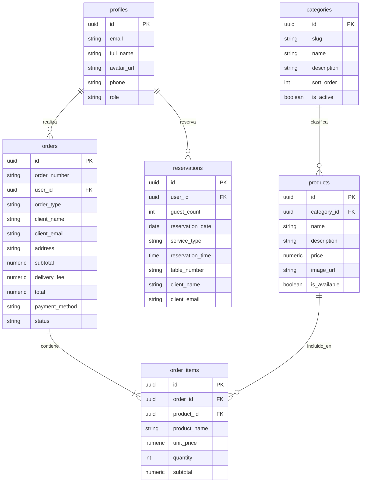

# 🗄️ Guía de Implementación de Base de Datos y Supabase — Las Flores Restaurante

Esta guía documenta la estructura, configuración y despliegue del backend relacional en **Supabase (PostgreSQL)** para el proyecto Las Flores.

---

## 📌 Contenido del Directorio

| Archivo | Descripción |
| :--- | :--- |
| **`schema.sql`** | Script DDL para la creación de tablas, llaves primarias, foráneas, índices y triggers de Google Auth. |
| **`storage_and_rls.sql`** | Configuración de reglas de seguridad RLS (*Row Level Security*) y creación de Buckets de Storage. |
| **`README.md`** | Guía de uso, configuración e instrucciones paso a paso. |

---

## 📐 Esquema de la Base de Datos

El sistema consta de 6 tablas relacionales principales:



---

## 🚀 Pasos para la Configuración en Supabase Cloud

### **Paso 1: Ejecutar los Scripts SQL**
1. Entra a tu proyecto en **[Supabase Cloud](https://supabase.com)**.
2. En el menú lateral izquierdo, selecciona **SQL Editor** (`>_`).
3. Haz clic en **New query**, copia y pega todo el contenido de **`schema.sql`** y presiona **Run**.
4. Abre otra consulta (**New query**), copia y pega todo el contenido de **`storage_and_rls.sql`** y presiona **Run**.

---

### **Paso 2: Configurar el Proveedor Google OAuth**
1. En Supabase, ve a **Authentication ➔ Providers ➔ Google**.
2. Copia la **Callback URL**: `https://<tu-proyecto-id>.supabase.co/auth/v1/callback`.
3. Ve a **[Google Cloud Console](https://console.cloud.google.com)** ➔ **APIs y servicios ➔ Credenciales**.
4. Crea una credencial de tipo **ID de cliente de OAuth** (Aplicación web).
5. En **Orígenes autorizados de JavaScript**, agrega:
   - `http://localhost:5173`
   - `https://<tu-proyecto-id>.supabase.co`
6. En **URIs de redireccionamiento autorizados**, pega la Callback URL copiada de Supabase.
7. Copia el **ID de cliente** y el **Secreto de cliente** de Google y pégalos en Supabase.
8. Activa el switch **Enable Sign in with Google** y guarda los cambios (**Save**).

---

## 💻 Configuración de Variables de Entorno

### **Para Desarrollo Local (`.env.local`)**
En la raíz de tu proyecto local, crea un archivo llamado `.env.local` con las claves de tu proyecto:

```env
VITE_SUPABASE_URL=https://<tu-proyecto-id>.supabase.co
VITE_SUPABASE_ANON_KEY=sb_publishable_...
```

### **Para Despliegue en Producción (Vercel)**
1. Entra al dashboard de tu proyecto en **[Vercel](https://vercel.com)**.
2. Ve a **Settings ➔ Environment Variables**.
3. Agrega las dos variables:
   - `VITE_SUPABASE_URL`
   - `VITE_SUPABASE_ANON_KEY`
4. Haz un nuevo **Redeploy** para aplicar los cambios a producción.
